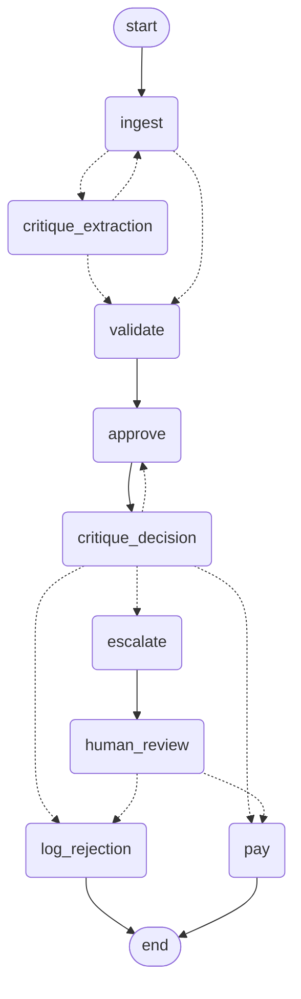

# A Message From Max

Hi there! Max here Thanks for sending over this challenge. It was super fun to knock out. 

I may have had an unfair advantage because invoice ingestion is fresh on my mind- I just built a very similar solution for one of my own clients. For the past year, I have been directly interfacing with small businesses and building custom solutions to help them out.

When Bella sent over the JD, I couldn't help but think it sounds exactly what I've been doing on my own. I would love to discuss the possibility of doing it on a larger scale. 

The rest of the README below this message is AI generated. Test the solution however you like.. I recommend using the 'make ui' command as you test your data sets. This streamlit ui provides a pretty nice real time visual of the system as it processes invoices.   

Some hopefully helpful screenshots:

Invoice processing with updates at each stage:


Invoice finished processing (rejected) with ledger below:


Audit Trail showing rejection.:


Next invoice was flagged for VP/human review with buttons to approve or reject:


Looking forward to meeting the team and finding out what Galatiq is up to!

Best,
Max 

# Acme Corp — invoice processing agents

Acme Corp loses about $2M a year to manual invoice handling: a 30% error rate, five-day
delays, and VP approvals that live in email threads. This is a working prototype of the
replacement: invoices in any format go in; payments, rejections with reasons, or a VP's
inbox item come out — in seconds, with an audit trail.

Built for the [Galatiq case](https://github.com/galatiq-ai/galatiq-case-invoices).
Python 3.12 · LangGraph · Grok (or any OpenAI-compatible model) · SQLite.

```bash
uv sync
uv run acme-ap run --all          # every sample invoice, no API key needed
uv run acme-ap queue              # what is waiting for the VP
uv run acme-ap resume INV-1017 --approve --note "Within budget, PO on file"
uv run acme-ap ledger             # paid / blocked / waiting, with dollar totals
```

The brief's exact entry point also works: `python main.py --invoice_path=data/invoices/invoice_1001.txt`.

## How it works

Four stages, arranged as a graph with two self-correction cycles and one real pause.
The diagram is generated from the compiled graph (`uv run acme-ap graph`), so it cannot drift from the code.



| Stage | Who does it | What happens |
|---|---|---|
| **Ingest** | code for JSON/XML/CSV; the **Extractor** agent for TXT/PDF | One `Invoice` shape out, whatever came in. The **Extraction Critic** audits the extraction against the source (with deterministic evidence: recomputed totals, line counts) and sends it back once if something is unsupported. |
| **Validate** | code, against SQLite | Stock on aggregated quantities, unknown items, arithmetic (lines + tax + shipping vs stated total), dates, vendor master, ledger duplicates, price deviation, currency, pressure language. Produces findings and a **policy floor**: approve / escalate / reject. |
| **Approve** | the **VP** agent (tool-calling: inventory, vendor master, ledger) | Decides with the floor as a hard minimum; the **Decision Critic** argues the other side once and the VP reconsiders. |
| **Pay / reject / escalate** | code | Approved → `mock_payment` + ledger. Rejected → ledger with the reasoning. Escalated → the graph **pauses** (`interrupt()`), the invoice appears in `acme-ap queue`, and a person finishes it later from the CLI or the web inbox. |

`make ui` opens the Streamlit page: pick an invoice, press Run, and the diagram above lights up node by node as LangGraph streams updates — finished nodes green, the running one amber, `human_review` orange when it pauses. The inbox underneath approves or rejects what paused, from the same checkpoint the CLI uses.

Four model roles, each one structured-output call with its own brief. Everything that is arithmetic is code.

## Five decisions worth defending

1. **Arithmetic is not judgement.** Whether 22 exceeds 15, whether $15,525 equals $14,750 + $885, whether a due date precedes the issue date — that is code, and it is tested. The model's discretion is spent where judgement is needed: reading messy documents and making the approve/escalate call.
2. **The model can only tighten the policy floor.** approve → escalate → reject, never back. `policy.max_conservative` enforces it and `test_model_cannot_loosen_the_floor` proves it. A persuasive vendor cannot talk a language model into paying for stock we don't have.
3. **Structured formats never touch the model.** JSON, XML and CSV are already structured; 10 of the 17 sample invoices make zero model calls. Fewer calls, no hallucination surface, and the run is fast where it can be.
4. **Escalation is a real pause, not a print statement.** `human_review` calls LangGraph's `interrupt()`; the thread sleeps in a SQLite checkpoint until `acme-ap resume` (or the Streamlit inbox) answers it — from another process, minutes or days later. That is what a VP approval actually is.
5. **It runs without a key, and says so.** With no model configured, structured invoices flow normally and unstructured ones go to the human queue with their raw text — they are not guessed. The run header names the mode.

## What the sample invoices really test

The brief names five scenarios; the data holds more. Every finding code below is triggered by a sample (one is a guard the samples stay inside).

| Code | Severity | Sample | What it catches |
|---|---|---|---|
| `UNKNOWN_ITEM` | block | 1008, 1016 | `WidgetC` is 86% similar to `WidgetA` — it is suggested, never substituted |
| `ZERO_STOCK_ITEM` | block | 1003 | `FakeItem`, the zero-stock placeholder |
| `STOCK_EXCEEDED` | warn | 1002, 1005, 1007, 1013 | on **aggregated** quantities — 1013 bills WidgetA on three lines (22 vs 15) |
| `INVALID_QUANTITY` / `INVALID_AMOUNT` | block | 1009 | negative quantity, negative total |
| `TOTAL_MISMATCH` | block | 1007, 1013 | 1007 is $110 *under* its own lines + tax; 1013 is $50 *over* |
| `MISSING_VENDOR` / `UNKNOWN_VENDOR` | block / warn | 1009 / 1003, 1008, 1012 | 1012's "QuickShip Distributers (formerly FastShip Ltd.)" — a rebrand is a lead, not a match |
| `DUE_DATE_SUSPECT` | warn | 1002, 1003, 1009 | due = issue under Net 30; due "yesterday"; no due date |
| `TERMS_MISMATCH` | warn | (none — 3-day tolerance) | due date disagrees with the stated Net terms by more than calendar rounding |
| `DUPLICATE_INVOICE` | warn / block | 1004 → 1004_revised | same number, different total = revision (warn); same total, already paid = double-pay (block) |
| `PRICE_DEVIATION` | warn | 1010 | `WidgetA (rush order)` at $300 vs $250 catalog |
| `CURRENCY_NOT_USD` | warn | 1014 | EUR invoice; pricing not compared |
| `FRAUD_LANGUAGE` | warn | 1003 | "URGENT", "immediately", "wire transfer", "penalties" |
| `OVER_10K` | info | 1002, 1003, 1005, 1007, 1013, 1017 | the brief's VP-scrutiny threshold |
| `EXTRACTION_UNAVAILABLE` | warn | any TXT/PDF with no model | goes to a human unread rather than guessed |

Also handled: OCR damage (`26-Jan-2O26`, `$3,500.O0` — letter O inside numbers), `Widget A` vs `WidgetA`, an invoice buried in an email body (1008), a key/value CSV whose repeated `item` keys `csv.DictReader` would silently drop (1006), and shipping lines that must be part of the arithmetic (1010).

`invoice_1017.json` was added: a clean $10,530 order, so the pure ">$10K needs scrutiny" rule is exercised by something — every other >$10K sample also has a fault.

**Policy-floor outcome of `acme-ap run --all`** — the VP agent may tighten any of these (approve → escalate → reject), never loosen them; without a model, the seven text invoices pause for a human instead:

| approve → paid | escalate → VP queue | reject → logged |
|---|---|---|
| 1001, 1004, 1006, 1011, 1015 | 1002, 1004_revised, 1005, 1010, 1012, 1014, 1017 | 1003, 1007, 1008, 1009, 1013, 1016 |

Batch order matters and the ledger shows it: 1004 is paid before 1004_revised arrives, so the revision is escalated; run 1004 again and it is blocked as a double payment.

Observed with **Grok** (`grok-4.5`): 18 files, 68 model calls, every outcome equal to the policy floor — 5 paid, 7 paused for the VP, 6 rejected — with no critic objections and no extraction sent back. With `gpt-5-mini`: 97 calls; the VP tightened 1002 and 1005 from escalate to reject after checking the inventory tool ("bills 20 GadgetX against 5 in stock"), which the floor permits.

## The stress set — what happens with data that isn't theirs

`data/stress/` holds ten invoices in shapes the sample set never showed, and `data/expected_outcomes.csv`
records the policy floor each one (and each sample) should land on. `uv run acme-ap eval` runs everything
and prints a scorecard; it exits non-zero on a mismatch, so it doubles as the regression check when a new
dataset arrives — drop the files in, add a row per file, run it.

| File | Shape | How it is handled |
|---|---|---|
| `stress_2001.json` | different key names (`supplier`, `items`, `sku`, `qty`, `amountDue`); vendor without the trailing period | reader synonyms parse it deterministically; the vendor master match ignores case, punctuation and corporate suffixes (still never fuzzy) |
| `stress_2002.csv` | different headers (`Supplier`, `Product`, `Quantity`, `Price`) | header synonyms |
| `stress_2003.xml` | attributes instead of child elements | the structured parse finds no usable lines, so the raw file goes to the Extractor instead of being trusted |
| `stress_2004.txt` | German labels, `EUR 1.250,00`, dotted day-first dates | European number and date parsing; escalates on currency |
| `stress_2005.txt` | 30 line items | quantities aggregate before the stock check (GadgetX 10 vs 5) |
| `stress_2006.json` | amounts as strings with currency codes (`USD 2,750.00`) | currency words stripped in `money()` |
| `stress_2007.pdf` | two pages | pages concatenated before extraction |
| `stress_2008.txt` | `WIDGETS INC`, `WIDGET-A` | tolerant vendor match; item canonicalisation drops hyphens |
| `stress_2009.json` | line amounts but no unit prices | unit price derived from amount ÷ quantity so pricing can still be checked |
| `stress_2010.txt` | not an invoice at all (a shipping notice) | the Extractor finds no lines → `EXTRACTION_INCOMPLETE` → rejected, not paid |

Observed with Grok (`grok-4.5`): **28 of 28** files land on their expected floor, 110 model calls, no extraction
sent back, no critic objection.

The inventory and vendor master are seeded from `data/inventory.csv` and `data/vendors.csv`, so a new
dataset can bring its own catalog without touching Python. The eight PDF/text twins (three samples, five
stress files) are the extraction regression set: `uv run pytest -m llm`.

## Models

One factory, one env var. Everything speaks the OpenAI-compatible chat API, so the reasoning engine is a config change.

| `LLM_PROVIDER` | Engine | Needs |
|---|---|---|
| `xai` | **Grok** via `https://api.x.ai/v1` (default `grok-4.5`) | `XAI_API_KEY` |
| `openai` | OpenAI (default `gpt-5-mini`) | `OPENAI_API_KEY` |
| `local` | any OpenAI-compatible server, e.g. LM Studio | `LOCAL_BASE_URL`, `LOCAL_MODEL` |
| `none` | no model — deterministic only | nothing |

Unset, it picks `xai` if `XAI_API_KEY` is present, then `openai`, then `none`. Copy `.env.example` to `.env`, then `uv run acme-ap doctor` to confirm the provider accepts the key.

Structured outputs use the provider's native JSON-schema mode and fall back to a forced tool call for servers that reject strict schemas (some local runtimes route constrained JSON into a "reasoning" field). Every model node carries a `RetryPolicy`; the CLI prints model calls and token counts per run.

## Tests

```bash
uv run pytest -q            # 144 tests, no network, no key
uv run pytest -m llm        # 8 more: PDF/text extraction vs its twin, needs a model
uv run acme-ap eval         # scorecard: 28 files vs data/expected_outcomes.csv
```

The PDFs ship with text or JSON twins, which makes extraction accuracy measurable: `tests/test_extraction_twins.py` extracts each PDF (and each unstructured stress file) with the model and diffs vendor, dates, totals and per-item quantities against the truth. Hand-written expected extractions for the text invoices live in `tests/fixtures/expected/` and double as the validation fixtures.

Covered offline: every reader and both CSV dialects; normalization (OCR, qualifiers, invoice-number forms, relative dates); every finding code against its sample; the policy floor and the "cannot loosen" invariant; both critique loops (bounded, and the objection reaches the second attempt); the pause, both resume paths, and duplicate detection across runs.

## Five-minute tour

```bash
uv run acme-ap run --all --reset                       # the table: 18 files, every outcome explained
uv run acme-ap run data/invoices/invoice_1012.pdf      # watch the model fix 2O26, Widget A, and spot the rebrand
uv run acme-ap queue                                   # what the VP would see
uv run acme-ap resume INV-1017 --approve --note "Within budget, PO on file"
uv run acme-ap ledger                                  # paid straight through / blocked / waiting
make ui                                                # watch the graph light up node by node, then approve from the web inbox
```

Every run also writes `runs/<timestamp>/events.jsonl` — one line per node, with what it decided and why. `acme-ap run <file> --json` dumps the final state.

## Layout

```
main.py                 the brief's entry point (a shim over acme_ap.cli)
src/acme_ap/
  models.py             Invoice / Finding / Critique / Decision, validators normalize on the way in
  readers.py            JSON, XML, two CSV dialects, TXT, PDF → Invoice | RawText
  normalize.py          pure helpers: OCR repair, item canonicalisation, money, dates
  db.py                 SQLite: inventory, vendor master, ledger (+ seed)
  validate.py           the finding codes
  policy.py             the floor, and max_conservative
  llm.py                provider factory + structured-output helper
  agents.py             Extractor, Extraction Critic, VP (tool-calling), Decision Critic
  graph.py              the LangGraph wiring, loops, interrupt, checkpoint types
  payment.py            mock_payment (verbatim from the brief) + ledger writes
  report.py             Rich console + events.jsonl
  cli.py                run / queue / resume / ledger / graph / setup-db
app.py                  Streamlit: live graph view while an invoice runs + the VP inbox (optional: uv sync --group ui)
data/stress/            ten invoices in shapes the samples never showed; data/expected_outcomes.csv scores them
tests/                  144 offline + 8 model-backed
```

## From prototype to production

What changes when this leaves the laptop — and what doesn't:

- **Ingestion**: real OCR (the PDF text layer won't always exist), an email connector, and a document store keyed by hash so the same file can't be submitted twice.
- **Systems of record**: the vendor master and inventory come from the ERP instead of a seed script; `mock_payment` becomes a posting to the AP subledger with a payment-run reference. The graph does not change.
- **Approvals**: routing by amount band and cost centre, SLA timers on paused threads, and the inbox in whatever the VP already opens (email, Slack, Teams). `interrupt()` already models the pause; only the delivery channel is missing.
- **Observability**: the `events.jsonl` becomes LangSmith / OpenTelemetry traces; the twin-file test becomes a nightly evaluation set that grows with every extraction correction a human makes.
- **The policy floor stays deterministic.** It is the part a controller can read, and the part that lets a finance team trust the rest.
